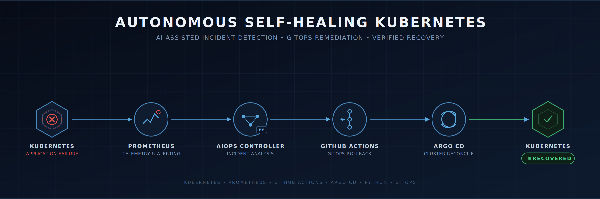
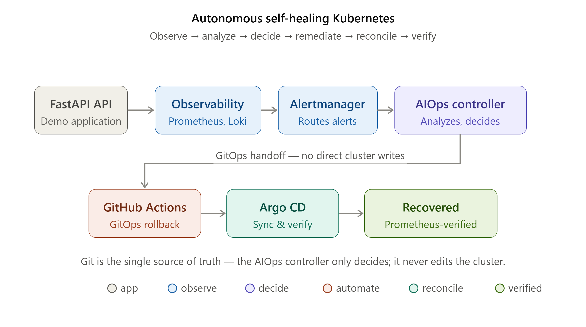
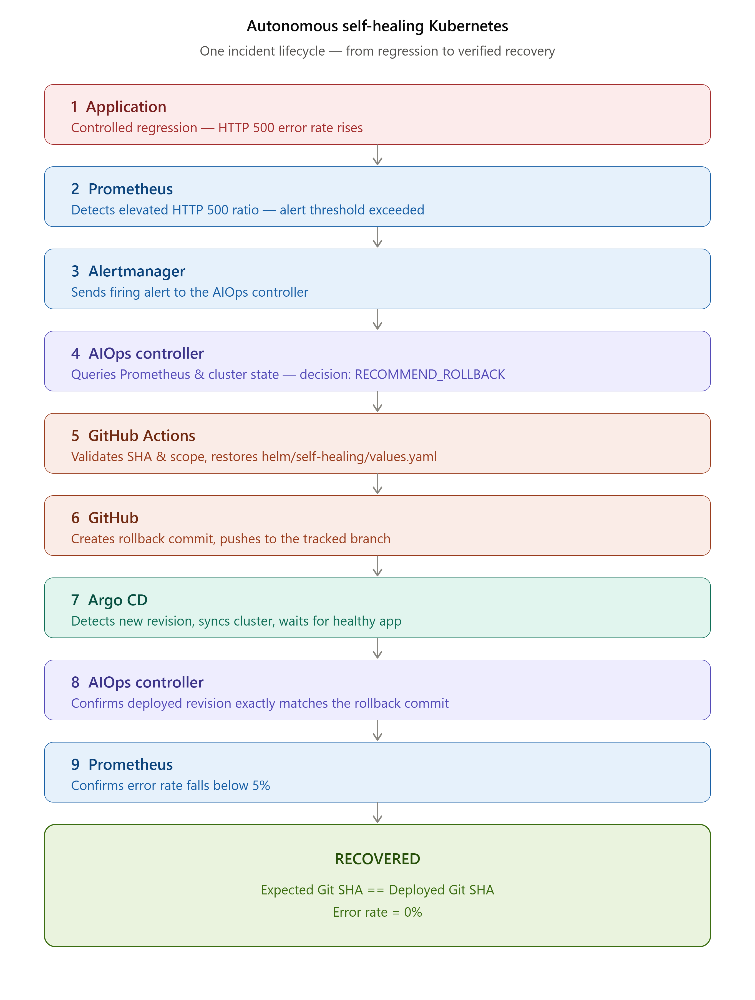

# Autonomous Self-Healing Kubernetes



An autonomous Kubernetes incident-response platform that detects application failures, analyzes telemetry and cluster state, makes confidence-based remediation decisions, performs GitOps rollback through GitHub Actions, lets Argo CD reconcile the cluster, and independently verifies recovery with Prometheus.

## Architecture





## What This Project Demonstrates

This project demonstrates an end-to-end autonomous remediation workflow for Kubernetes workloads:

* Observability-driven incident detection
* Prometheus and Alertmanager integration
* Kubernetes state analysis
* Confidence-based remediation decisions
* GitHub Actions-based GitOps remediation
* Argo CD reconciliation
* Safe rollback scope validation
* Exact Git revision verification
* Automated application recovery verification
* Continuous recovery confirmation using Prometheus

The remediation path is designed to distinguish an application-level regression from a simple infrastructure restart condition before recommending rollback.

## Technology Stack

| Component              | Technology                           |
| ---------------------- | ------------------------------------ |
| Application            | FastAPI / Python                     |
| Containerization       | Docker                               |
| Kubernetes             | Kubernetes / Kind                    |
| Packaging              | Helm                                 |
| GitOps                 | Argo CD                              |
| Metrics                | Prometheus                           |
| Alerting               | Alertmanager                         |
| Logging                | Loki / Promtail                      |
| AIOps controller       | Python / FastAPI                     |
| Kubernetes integration | Kubernetes Python client             |
| Remediation            | GitHub Actions                       |
| CI/CD                  | GitHub Actions                       |
| Security               | Trivy                                |
| Testing                | Python tests / Kubernetes validation |

## Repository Structure

```text
autonomous-self-healing-k8s/
├── app/
│   └── src/
│       └── main.py
│
├── aiops/
│   ├── src/
│   │   ├── analyzer.py
│   │   ├── config.py
│   │   ├── decision.py
│   │   ├── github_actions.py
│   │   ├── k8s_analyzer.py
│   │   ├── main.py
│   │   └── remediation.py
│   ├── Dockerfile
│   └── requirements.txt
│
├── helm/
│   └── self-healing/
│       ├── templates/
│       ├── Chart.yaml
│       └── values.yaml
│
├── kubernetes/
│   ├── aiops/
│   ├── monitoring/
│   └── ...
│
├── .github/
│   └── workflows/
│       └── aiops-remediation.yml
│
└── README.md
```

## How the Self-Healing Loop Works



### 1. Application regression

The demo API supports a controlled failure mode using:

```yaml
failureRate: "0.50"
```

When enabled, approximately half of `/api/orders` requests return HTTP 500 responses.

### 2. Prometheus detection

Prometheus calculates the HTTP 500 error ratio over a two-minute window.

The alert fires when:

```text
error rate > 5%
```

for the configured alert duration.

### 3. Alertmanager notification

Alertmanager sends the firing alert to:

```text
/webhook/alertmanager
```

on the AIOps controller.

### 4. AIOps analysis

The controller combines:

* Prometheus error-rate telemetry
* HTTP 500 rate
* total request rate
* Kubernetes deployment health
* ready and available replicas
* pod restart information

A confidence score is calculated before remediation.

Rollback is recommended only when confidence reaches the configured threshold.

### 5. GitOps remediation

The AIOps controller invokes:

```text
aiops-remediation.yml
```

on the branch tracked by Argo CD.

The workflow validates:

* source and target revisions
* revision ancestry
* rollback target
* rollback scope

Only the intended application configuration file is restored:

```text
helm/self-healing/values.yaml
```

Unrelated changes are preserved.

### 6. Workflow verification

The controller waits for the GitHub Actions workflow to complete and requires:

```text
workflow status = completed
workflow conclusion = success
```

It then waits for the tracked Git branch to advance and records the exact rollback commit SHA.

### 7. Argo CD reconciliation

Argo CD detects the new Git revision and synchronizes the application.

The recovery verifier requires the deployed revision to exactly match the rollback revision created by GitHub Actions.

### 8. Prometheus recovery verification

Recovery is considered successful only when:

```text
Argo sync      = Synced
Argo health    = Healthy
Git revision   = expected rollback revision
Error rate     < 5%
```

The controller then reports:

```text
RECOVERED
```

## Safety Controls

The remediation workflow includes several safety mechanisms.

### Confidence threshold

The controller does not automatically roll back every alert.

The remediation decision requires high confidence.

### Git revision validation

The workflow validates the requested current and target revisions before mutation.

### Rollback scope validation

Only the intended Helm configuration file is modified.

For example:

```text
helm/self-healing/values.yaml
```

Other changes, such as AIOps code improvements, remain untouched.

### Dry-run support

The controller supports:

```text
AIOPS_DRY_RUN=true
```

for safe validation without committing changes.

### Exact revision verification

The controller records the Git commit produced by the remediation workflow and requires Argo CD to deploy that exact revision.

### Recovery verification

A successful GitHub workflow alone does not mean the incident is recovered.

The system also verifies Kubernetes health and Prometheus telemetry.

## Verified Failure-Recovery Test

The final end-to-end test intentionally introduced:

```yaml
failureRate: "0.50"
```

The resulting telemetry reached approximately:

```text
HTTP error rate ≈ 50%
```

The AIOps controller produced:

```text
Decision: RECOMMEND_ROLLBACK
confidence=1.000
```

GitHub Actions completed successfully and created the rollback commit:

```text
048893b84b94db855b55e417c254430b632046d2
```

Argo CD then deployed that exact revision.

Final state:

```text
Argo Sync:        Synced
Argo Health:      Healthy
Deployed SHA:     048893b84b94db855b55e417c254430b632046d2
Expected SHA:     048893b84b94db855b55e417c254430b632046d2
Application:      Healthy
FAILURE_RATE:     0
Prometheus rate:  0.0
Recovery status:  RECOVERED
```

The final AIOps verification was:

```text
revision_ok=True
error_rate=0.0
recovered=True

Recovery verification:
{'status': 'RECOVERED', ...}
```

## Example Autonomous Flow

```text
FAILURE_RATE=0.50
        │
        ▼
HTTP 500 rate rises
        │
        ▼
Prometheus alert
        │
        ▼
Alertmanager
        │
        ▼
AIOps Controller
        │
        ├── Prometheus analysis
        ├── Kubernetes analysis
        └── confidence decision
        │
        ▼
RECOMMEND_ROLLBACK
        │
        ▼
GitHub Actions
        │
        ├── validate revisions
        ├── validate rollback scope
        ├── restore Helm values
        ├── commit
        └── push
        │
        ▼
Argo CD
        │
        ▼
Exact rollback SHA deployed
        │
        ▼
FAILURE_RATE=0
        │
        ▼
Prometheus error rate=0
        │
        ▼
RECOVERED
```

## Running the Project

### Start the Kubernetes environment

Create or start the Kind cluster and deploy the required components.

### Verify the application

```powershell
kubectl -n self-healing get pods
kubectl -n self-healing get deployment
```

### Verify Argo CD

```powershell
kubectl -n argocd get application self-healing
```

Expected:

```text
Synced
Healthy
```

### Verify the demo application

```powershell
kubectl -n self-healing exec deployment/self-healing-api -- printenv APP_VERSION
kubectl -n self-healing exec deployment/self-healing-api -- printenv FAILURE_RATE
```

### Watch the AIOps controller

```powershell
kubectl -n self-healing logs deployment/aiops-controller -f
```

## Test the Failure Scenario

Set the demo failure rate:

```yaml
failureRate: "0.50"
```

Commit and push the change to the Argo-tracked branch.

Generate API traffic and wait for Prometheus/Alertmanager to trigger the incident.

The controller should autonomously initiate the GitOps remediation process.

## Recovery Criteria

The system reports recovery only when all of the following are true:

```text
GitHub workflow completed successfully
        +
rollback branch advanced
        +
Argo deployed exact rollback SHA
        +
Argo is Healthy
        +
Prometheus error rate < 5%
```

## Design Principles

This project intentionally separates:

* Detection
* Analysis
* Decision
* Remediation
* Reconciliation
* Verification

The AIOps controller does not directly mutate application Kubernetes resources during remediation.

Instead, it creates a validated GitOps remediation request and lets GitHub Actions modify Git, while Argo CD remains responsible for cluster reconciliation.

This preserves Git as the source of truth.

## Future Improvements

Possible future enhancements include:

* richer log-based root-cause analysis using Loki
* additional remediation strategies beyond rollback
* incident history and remediation audit storage
* Grafana dashboards for remediation decisions
* Slack / Microsoft Teams incident notifications
* policy-based remediation approval
* multi-service dependency analysis
* progressive remediation and canary rollback
* anomaly detection before alert thresholds are crossed
* OpenTelemetry integration
* persistent AIOps decision history

## Project Goal

The project demonstrates how Kubernetes observability, AIOps decision-making, GitOps, and automated verification can be combined to create a controlled autonomous remediation loop.

The key principle is:

```text
Detect → Analyze → Decide → Remediate → Reconcile → Verify
```

rather than:

```text
Alert → blindly restart container
```
